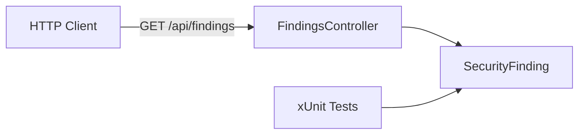

# AppSec Workbench

AppSec Workbench is an application security engineering project for investigating
security findings from detection through root-cause analysis and verified remediation.

The project is built around a simple workflow:

**find → reproduce → trace → understand → fix → verify**

## Architecture



## Current status

Early development.

The current implementation includes:

- ASP.NET Core API
- initial security finding domain model
- typed finding severity and status
- read-only findings API endpoint
- xUnit domain tests

## Development

Build:

```bash
dotnet build
```

Run:

```bash
dotnet run --project src/AppSecWorkbench.Api
```

The development API exposes:

```
GET /api/findings
```