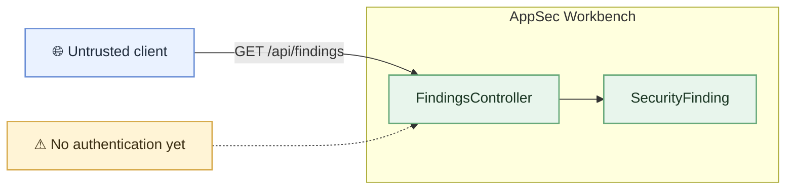

# Security Model

AppSec Workbench currently exposes a single read-only API for security findings.

## Attack surface

## Current assumptions

- findings are read-only
- there is no authentication or authorization yet
- there is no database or external integration
- only development data is exposed

Security finding data should be treated as sensitive once real findings are stored.

## Reassess when

Revisit this model when adding authentication, write operations, persistence,
scanner integrations, source-code access, or multiple users.